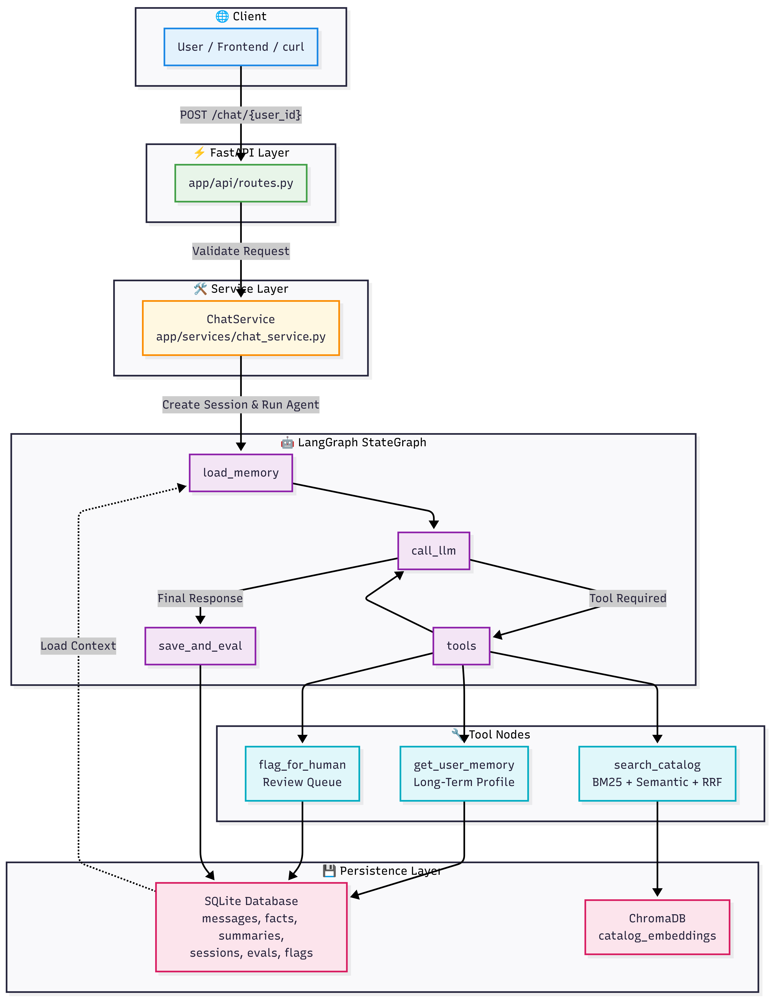

# ⚡ SaaSify Sales Assistant Agent

[](https://www.python.org/downloads/)
[](https://fastapi.tiangolo.com/)
[](https://github.com/langchain-ai/langgraph)
[](https://www.sqlite.org/index.html)
[](https://openai.com/)

> **The ultra-smart, relationship-first AI Sales Assistant.** Stop letting leads fall cold. SaaSify uses a state-of-the-art double-loop memory architecture and real-time self-evaluations to guide prospects down the sales funnel with precision, empathy, and absolute accuracy.

---

## 🔮 The Core Philosophy

Traditional sales chatbots are forgetful, hallucinate pricing, and feel robotic. **SaaSify is different.** Built with a double-loop LangGraph architecture, SaaSify mimics a top-performing human sales representative:

- 🧠 **It remembers every detail** across sessions (budget, team size, core pain points).
- 🔍 **It acts with absolute truth**, checking its catalog before answering any feature or pricing query.
- 🚦 **It knows when to escalate**, handing off complex negotiations or custom demos to a human sales rep.
- 🛡️ **It evaluates itself** in real-time on every response, ensuring maximum quality.

---

## 🏗️ Architecture & System Design

SaaSify operates on a **double-loop system**: a **conversational loop** that executes agent decisions, and a **reflection loop** that manages memory and runs self-evaluations.



---

## 🧠 Two-Tier Memory Architecture

At the heart of SaaSify is its sophisticated two-tier memory engine, designed to keep context window costs low while maximizing relationship depth.

### 🔄 1. Short-Term Memory (Conversational context)

- **The Problem:** Chat histories grow infinitely, ballooning LLM costs and degrading response relevance.
- **The SaaSify Solution:** We keep a sliding window of the last **10 raw messages**. Once the conversation exceeds **20 messages**, our background model automatically summarizes the older context into a single concise paragraph. The model never loses the big picture, but works with minimal token overhead.

### 💾 2. Long-Term Memory (Persistent User Profile)

- **The Problem:** Prospects don't like repeating their requirements, budget constraints, or team sizes across chat sessions.
- **The SaaSify Solution:** After every exchange, a lightweight evaluation call extracts structured facts (e.g. `team_size=50`, `budget=$500/mo`, `plan_interest=Enterprise`) and saves them as key-value pairs in SQLite. These facts are automatically injected into the agent's system prompt on every new request, forever.

---

## 🛡️ Autonomous Self-Correcting Eval Loop

SaaSify is self-aware. Immediately after the agent generates a response, it is scored by a second, independent evaluation call.

We evaluate every turn across three critical dimensions (0.0 to 1.0):

| Metric             | Focus Area                                                                    | Guardrail Action                                  |
| ------------------ | ----------------------------------------------------------------------------- | ------------------------------------------------- |
| **`groundedness`** | Verifies the response is fully backed by the catalog (detects hallucination). | Flagged for review if hallucination is suspected. |
| **`relevance`**    | Measures if the response directly addresses the prospect's query.             | Triggers correction if relevance is low.          |
| **`confidence`**   | Overall quality and reliability check.                                        | Triggers flag to human sales reps if score < 0.7. |

---

## 🧪 Interactive Demo: Cross-Session Memory

Experience the magic of cross-session memory persistence using these two simple curl commands.

### 🌟 Part 1: Establish Context

The prospect introduces themselves and details their company parameters in session 1.

```bash
curl -X POST https://your-app.railway.app/chat/demo_user \
  -H "Content-Type: application/json" \
  -d '{"message": "Hi! We are a 50-person fintech company considering Enterprise. Our CTO will make the final call."}'
```

- **Behind the Scenes:** The agent answers Enterprise details. The reflection loop extracts and saves: `team_size=50`, `industry=fintech`, `decision_maker=CTO`.

### ⚡ Part 2: Return & Remember (Days later, new session)

The user returns, starting a completely fresh request, and asks a context-dependent question.

```bash
curl -X POST https://your-app.railway.app/chat/demo_user \
  -H "Content-Type: application/json" \
  -d '{"message": "Does the plan we discussed include audit logs?"}'
```

- **The Magic:** Because long-term memory is injected, the agent answers: _"Yes, the Enterprise plan (which we discussed for your 50-person fintech team) includes full audit logs."_ Memory persists instantly!

---

## 🔌 API Endpoints

SaaSify provides a clean, well-structured REST API built with FastAPI.

| Method   | Endpoint                  | Description                                                                |
| :------- | :------------------------ | :------------------------------------------------------------------------- |
| `POST`   | `/chat/{user_id}`         | Send a message to the agent, running the full memory + eval loop.          |
| `GET`    | `/chat/{user_id}/history` | Retrieve full chronological message history across all sessions.           |
| `GET`    | `/chat/{user_id}/evals`   | Retrieve aggregated evaluation statistics (groundedness, relevance, etc.). |
| `DELETE` | `/chat/{user_id}/memory`  | GDPR-compliant wipe of all short/long-term memory for a user.              |
| `GET`    | `/catalog`                | Retrieve the current raw product catalog.                                  |
| `GET`    | `/health`                 | Check service health and database availability status.                     |
| `GET`    | `/docs`                   | Open interactive Swagger UI documentation.                                 |

---

## 🚀 Getting Started

Flesh out your local SaaSify instance in minutes.

### 1. Clone & Set Up environment

```bash
git clone <your-repo-url>
cd sales_agent

# Create virtual environment
python3 -m venv venv
source venv/bin/activate

# Install dependencies
pip install -r requirements.txt
```

### 2. Configure Credentials

```bash
cp .env.example .env
# Edit .env and supply your OPENAI_API_KEY
```

### 3. Initialize Database

We use Alembic to manage database migrations seamlessly.

```bash
python3 -m alembic -c alembic.ini upgrade head
```

### 4. Run the Dev Server

```bash
uvicorn main:app --host 0.0.0.0 --port 8000 --reload
```

Open [http://localhost:8000/docs](http://localhost:8000/docs) to access the interactive Swagger UI.

---

## ⛵ Deploy to Railway

SaaSify comes pre-configured with a production-grade `Dockerfile` for seamless deployment to Railway.

1.  Push your code to your GitHub repository.
2.  Go to [railway.app](https://railway.app) → **New Project** → **Deploy from GitHub**.
3.  Add the following environment variables in the Railway dashboard:
    - `OPENAI_API_KEY` = `your-api-key`
    - `DATABASE_URL` = `sqlite:///./sales_agent.db` (or a persistent volume/Postgres URL)
4.  Railway will automatically detect the Dockerfile, build, and deploy the service.
5.  Update the `Live URL` placeholder in this README with your Railway project domain!

---

## 📁 Directory Structure

```text
sales_agent/
├── app/
│   ├── api/routes.py            # HTTP routes & endpoint controllers
│   ├── agents/agent_loop.py     # LangGraph StateGraph & ReAct agent loops
│   ├── memory/
│   │   ├── base.py              # Memory abstract interface
│   │   └── sqlite_backend.py    # SQLite memory engine (2-tier implementation)
│   ├── services/
│   │   ├── chat_service.py      # Core chat coordination and orchestrator
│   │   └── eval_service.py      # Self-evaluation & fact extraction engine
│   ├── tools/
│   │   └── search_catalog.py    # BM25 + Semantic + RRF hybrid search
│   ├── db/
│   │   ├── database.py          # SQLAlchemy session setup
│   │   └── models.py            # SQLite database tables
│   └── config.py                # Environment configurations
├── migrations/                 # Database migrations
├── catalog.json                 # Mock product catalog data
├── main.py                      # FastAPI app initializer
└── Dockerfile                   # Production container setup
```

---

_Built with ❤️ by the SaaSify Engineering Team._
